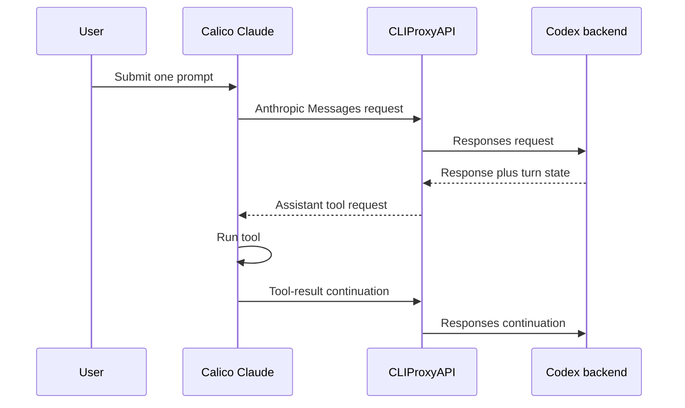
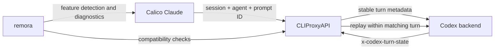

# Preserving Codex Active-Turn Fair Use Through the Claude Bridge

> **Status:** Protocol implementation and contract tests complete for the supported single-credential topology. A live allowance-boundary Turn A test is still pending, so backend fair-use parity is not yet claimed.

## Contents

- [Question](#question)
- [Context](#context)
- [Findings](#findings)
- [Interpretation](#interpretation)
- [Recommendation](#recommendation)
- [Implementation status](#implementation-status)
- [Proposed change set](#proposed-change-set)
- [Verification](#verification)
- [Security constraints](#security-constraints)
- [Open questions](#open-questions)

## Question

When a ChatGPT Codex allowance is exhausted during work that has already started, OpenAI says Codex can continue that active turn subject to fair-use limits. remora currently reaches Codex through Claude Code and CLIProxyAPI. The question is whether this bridge preserves enough turn identity for the Codex backend to recognize every tool continuation as part of the same active turn.

The required outcome is parity with native Codex: the bridge must not terminate work merely because it lost active-turn state. It cannot promise unlimited execution after exhaustion because the backend may still end an active turn under its fair-use policy.

## Context

The affected path is:



Claude's Messages API is stateless at the HTTP boundary: each tool result causes another request containing conversation history. Codex, by contrast, maintains explicit per-turn client/server state across those requests. A session identifier is not sufficient because one Claude session contains many separate user turns.

This investigation used the following revisions:

| Component | Revision examined | Purpose |
|---|---|---|
| OpenAI Codex | commit [`9e552e9`](https://github.com/openai/codex/tree/9e552e9d15ba52bed7077d5357f3e18e330f8f38) | Establish the native active-turn contract and hard-limit behavior |
| CLIProxyAPI | research on deployed `v7.2.67`; implementation based on `v7.2.71` | Trace the original defect and build the bounded compatibility bridge |
| Calico Claude | Claude Code `2.1.207` patched bundle | Determine whether Claude has a stable user-turn identifier |
| Home-lab deployment | CLIProxyAPI `v7.2.67` on 2026-07-12 | Compare source behavior with the running gateway and observed 429 sequence |

## Findings

### Native Codex uses server-issued per-turn state

Codex creates a fresh `ModelClientSession` for each turn. The Codex source defines `x-codex-turn-state` as a server-issued sticky-routing token that must be replayed unchanged for retries, incremental appends, and continuation requests within the same turn. It must not be reused for a later turn.

The implementation receives this value from the first upstream response, stores it in a turn-scoped `OnceLock`, and adds it to subsequent Responses requests. The test suite asserts that the first request has no state, a tool continuation echoes the returned state, and the next user turn clears it.

| Native behavior | Evidence |
|---|---|
| Define the per-turn state contract | [`core/src/client.rs` lines 259–285](https://github.com/openai/codex/blob/9e552e9d15ba52bed7077d5357f3e18e330f8f38/codex-rs/core/src/client.rs#L259-L285) |
| Capture the HTTP response header | [`codex-api/src/sse/responses.rs` lines 62–69](https://github.com/openai/codex/blob/9e552e9d15ba52bed7077d5357f3e18e330f8f38/codex-rs/codex-api/src/sse/responses.rs#L62-L69) |
| Replay the header on later requests | [`core/src/client.rs` lines 1861–1884](https://github.com/openai/codex/blob/9e552e9d15ba52bed7077d5357f3e18e330f8f38/codex-rs/core/src/client.rs#L1861-L1884) |
| Reset state at the next turn | [`core/tests/suite/turn_state.rs` lines 21–91](https://github.com/openai/codex/blob/9e552e9d15ba52bed7077d5357f3e18e330f8f38/codex-rs/core/tests/suite/turn_state.rs#L21-L91) |

Codex also sends a stable `turn_id`, `turn_started_at_unix_ms`, `session_id`, `thread_id`, and canonical `client_metadata["x-codex-turn-metadata"]` throughout the turn. These values are additional backend-visible continuity signals, but the public source describes only `x-codex-turn-state` as the explicit same-turn sticky-state contract.

### A hard usage-limit response terminates native Codex

When the backend actually returns HTTP 429 with `error.type = "usage_limit_reached"`, Codex maps it to `UsageLimitReached`, treats it as non-retryable, and immediately ends the current turn. The client does not ignore that error or continue locally.

| Native behavior | Evidence |
|---|---|
| Parse the hard usage-limit response | [`codex-api/src/api_bridge.rs` lines 85–105](https://github.com/openai/codex/blob/9e552e9d15ba52bed7077d5357f3e18e330f8f38/codex-rs/codex-api/src/api_bridge.rs#L85-L105) |
| Return immediately from the sampling loop | [`core/src/session/turn.rs` lines 1174–1184](https://github.com/openai/codex/blob/9e552e9d15ba52bed7077d5357f3e18e330f8f38/codex-rs/core/src/session/turn.rs#L1174-L1184) |

Therefore, the documented active-turn allowance must occur before a hard 429 reaches the client: the backend continues accepting recognized active-turn requests until its fair-use policy ends that allowance.

### CLIProxyAPI drops the active-turn state on the Claude HTTP path

The deployed CLIProxyAPI version routes Claude `/v1/messages` traffic through the Codex HTTP executor, not the native Responses WebSocket path. Its HTTP header builder forwards Codex turn metadata and a client request ID when a downstream client already supplied them, but it does not forward `x-codex-turn-state`.

The upstream response headers are retained only in request-scoped logging metadata and the response object. They are not stored in a session- or turn-scoped cache for the next Claude tool-result request. Enabling response-header passthrough would not repair this: stock Claude does not persist an arbitrary Codex response header and return it with its next Anthropic request.

| CLIProxyAPI behavior | Result |
|---|---|
| Stable Claude `session_id` becomes a prompt-cache/session key | Preserves session affinity, not a user-turn boundary |
| HTTP header builder omits `x-codex-turn-state` | Tool continuations cannot replay backend-issued active-turn state |
| Response headers enter request-local logging state | The next HTTP request cannot retrieve them |
| WebSocket executor accepts turn state from its downstream client | Not used by the Claude HTTP/SSE bridge |
| `passthrough-headers` is enabled | Still insufficient because Claude does not echo the header |

The relevant HTTP builder is visible in [`codex_executor.go` lines 1619–1634](https://github.com/router-for-me/CLIProxyAPI/blob/2075f77/internal/runtime/executor/codex_executor.go#L1619-L1634). This is a confirmed bridge defect, independently of whether the backend uses the sticky token alone or combines it with other turn metadata for fair-use decisions.

### Claude has a stable prompt identifier but does not send it

Claude Code `2.1.207` maintains an internal `prompt_id` whose documented scope is one user prompt and all subsequent events until the next prompt. Inspection of an actual transcript confirmed that the initial user message and later tool-result messages retain the same UUID.

Hooks, the status line, and OpenTelemetry can observe this value. The Anthropic HTTP request does not expose it: request headers carry session and agent identity, while `metadata.user_id` carries device, account, session, and parent-session data. Static custom-header environment variables and hook subprocesses cannot safely inject a new value into every later request.

Calico can expose this existing identifier with a small adapter. The versioned bridge uses `x-calico-prompt-id` plus `x-calico-active-turn-version: 1`. For foreground work, reading the current prompt ID at request construction is sufficient. For a background agent that outlives its spawning prompt, Calico must capture the prompt ID in the agent context at spawn time; otherwise later requests may inherit the next user prompt's global ID.

### The observed 429 sequence is not proof of fair-use continuity

The home-lab gateway recorded successful Claude requests through 22:15:40, followed by repeated 429 responses beginning at 22:15:41. Request logging was not configured to retain the complete turn identity, so this sequence proves only that upstream requests crossed into a hard-limit response. It does not prove that the rejected requests carried native Codex active-turn state.

Likewise, a later 200 after retry proves only that a request eventually succeeded. It does not prove that the backend grandfathered the original active turn.

## Interpretation

The current bridge preserves a Claude session but not a Codex active turn. This distinction explains why a long-running remora task can stop at the allowance boundary even though native Codex may continue the work under backend fair-use rules.

The public Codex source does not reveal the backend quota implementation. It proves the client/server turn-state contract and proves that the client stops on a hard limit; it cannot prove that `x-codex-turn-state` is the sole fair-use key. The safest compatibility target is therefore the complete observable native contract: stable turn identity metadata plus replay of the exact server-issued state.

> **Important:** This work can guarantee protocol parity with native Codex, not unlimited post-quota execution. OpenAI explicitly makes active-turn continuation subject to backend fair-use limits.

## Recommendation

Implement the feature across Calico and CLIProxyAPI, while keeping remora as the integration and policy surface. Neither component can solve the problem alone: Calico knows the real Claude prompt/agent boundary, while CLIProxyAPI is the only component that sees both the Codex response header and the next upstream request.



The turn cache should be keyed by credential identity, Claude session ID, Claude agent ID, and Claude prompt ID. The first request creates stable Codex metadata and captures the server state. Tool continuations and retries reuse both. A new prompt ID creates a fresh turn. Count-token and other auxiliary requests must not create or mutate turn state.

## Implementation status

The v1 bridge deliberately advertises support only for one local Codex credential with cooling disabled. This is a correctness boundary, not a convenience default: a round-robin or failover selector can move a continuation to another account before the executor sees it, and Home mode can move it to another proxy instance. Either transition invalidates server-issued state.

| Surface | Implemented behavior | Verification |
|---|---|---|
| Calico request scope | Headers are emitted only for Claude's `main` and `subagent` query classes | Auxiliary quota, count-token, compact, and side-query tests pass |
| Agent causality | Background agents freeze their spawning prompt; nested agents inherit the frozen parent prompt | Unit tests cover main advance, nested spawn, and dormant native launch |
| Header ownership | Calico writes its reserved headers after custom headers | Forged custom-header test is overwritten by the trusted values |
| Proxy identity | One turn retains stable installation, session, thread, window, cache, turn ID, and start time across model fallback | Integration and fallback tests pass |
| Backend state | First successful response captures the first non-empty `x-codex-turn-state`; matching continuations replay it | Fake-backend integration and race tests pass |
| Hard limit | `usage_limit_reached` deletes and zeroes state and rejects already-waiting duplicates | HTTP hard-terminal and store lifecycle tests pass |
| Capability | Gateway advertises v1 only when the feature flag, one credential, disabled cooling, and local non-Home topology all agree | Positive and degraded capability tests pass |
| Live backend | A new turn after exhaustion receives hard 429 | Control observed; pre-boundary Turn A continuation remains pending |

> **Current support boundary:** multi-credential routing, Home/multi-instance deployment, and long-lived teammate processes that accept multiple independent prompts are not advertised by v1. `remora doctor --online` reports `DEGRADED` when either side is absent or the gateway topology is unsafe.

## Proposed change set

| Component | Required change | Why this owner | Value if changed alone |
|---|---|---|---|
| Calico Claude | Add versioned `x-calico-prompt-id` and `x-calico-active-turn-version` request headers | Claude owns the real user-prompt lifecycle | Identifies turns but cannot preserve backend state; insufficient alone |
| Calico Claude | Capture the spawning prompt ID in per-agent context | Prevent background agents from switching turns after later user input | Required for strict agent causality; a global prompt getter is insufficient |
| CLIProxyAPI | Key active turns by credential, session, agent, and prompt | Proxy must isolate concurrent sessions and agents | Cannot be reliable without a stable prompt ID |
| CLIProxyAPI | Generate stable Codex turn metadata for the first request | Backend should see the same identity shape across every continuation | Helpful but incomplete without server-issued state replay |
| CLIProxyAPI | Capture and replay `x-codex-turn-state` | Only the proxy sees both sides of the bridge | Core active-turn compatibility requirement |
| CLIProxyAPI | Preserve state across transport retries and generic retryable limits; treat hard `usage_limit_reached` as terminal | Match native Codex error semantics without losing state during an ordinary continuation retry | Required lifecycle and safety behavior |
| remora | Detect compatible Calico and gateway capabilities in `doctor --online` | remora owns the supported integration contract | Prevents silent false confidence; does not fix transport alone |
| remora | Document the capability and downgrade behavior | Users must know when native parity is unavailable | Documentation only; no runtime repair |

### Changes that do not solve the problem

| Proposed shortcut | Why it is insufficient |
|---|---|
| Increase `request-retry` or Claude retry rounds | Repeats a request that still lacks the active-turn contract |
| Disable CLIProxyAPI cooldown | Avoids a local selector block but does not make the backend recognize a turn |
| Enable response-header passthrough | Claude does not save and echo arbitrary Codex headers |
| Change only remora aliases or environment variables | The launcher sees neither the backend response nor Claude's evolving HTTP requests |
| Add only a Calico prompt header | The backend-issued state still disappears inside the proxy |
| Add only a proxy state cache keyed by session | One session contains many prompts; resume, compaction, and concurrency make inference unsafe |
| Infer turns by hashing the last user message | Tool results, compaction, injected messages, and background agents make this heuristic unstable |
| Treat any 200 after a 429 as success | It may reflect reset, account switching, or ordinary retry rather than active-turn fair use |

## Verification

Contract tests are complete for the v1 topology. The real quota-boundary test remains the release acceptance for any claim of backend fair-use parity.

| Test layer | Required assertion |
|---|---|
| Calico unit/integration | Initial request, tool results, retry, and fallback share one prompt ID; the next user prompt changes it |
| Calico agent lifecycle | Foreground and background agents retain their spawning prompt ID; separate agents remain isolated |
| Proxy integration | A fake backend returns `x-codex-turn-state`; every matching continuation replays the exact value and stable metadata |
| Proxy boundary | A new prompt omits prior state and receives a new turn ID; auxiliary requests never touch the cache |
| Proxy concurrency | Parallel agents and credentials never read each other's state; duplicate first requests are single-flight safe |
| Proxy error handling | Network errors and generic retryable limits retain the active turn; hard `usage_limit_reached` is surfaced as terminal; completion and TTL reclaim state safely |
| remora diagnostics | Unsupported Calico or gateway builds report that active-turn parity is unavailable rather than silently passing |

The only valid live fair-use acceptance test is a controlled allowance-boundary comparison:

```text
1. Use exactly one Codex credential and disable account fallback.
2. Start Turn A before the allowance boundary with a deterministic multi-tool task.
3. Confirm every continuation has the same prompt ID, turn ID, start time, and hashed turn-state value.
4. After the allowance is exhausted, show that Turn A continues to a terminal assistant answer without user input.
5. While Turn A is still active, show that a new Turn B on the same credential receives usage_limit_reached.
6. Repeat with native Codex as the control when practical.
```

Passing only step 4 is insufficient. The simultaneous rejection of a genuinely new turn is what distinguishes active-turn fair use from an allowance reset or retry delay.

## Security constraints

Treat `x-codex-turn-state` as sensitive opaque backend state. Store it only in memory, scope it to one credential and turn key, never include its raw value in normal logs, and erase it after a bounded TTL. Diagnostics should log only a one-way truncated hash that can correlate requests without exposing the token.

The Calico header contains a correlation UUID rather than credentials, but it still links activity within a prompt. CLIProxyAPI should strip it before forwarding unless it deliberately maps the value into Codex metadata. remora must continue to leave native Claude configuration and authentication untouched.

## Open questions

| Question | How to close it |
|---|---|
| Which exact metadata fields participate in backend fair-use decisions? | Preserve the full native observable contract, then compare controlled traces with native Codex |
| How long may an active turn continue after exhaustion? | Measure only through an actual quota-boundary test; backend policy is not public |
| Does backend fair use apply independently to each subagent turn? | Run isolated parent/child and parallel-agent boundary tests with one credential |
| What terminal event should reclaim proxy state immediately? | Compare Claude `stop_reason`, downstream disconnects, retries, and lost-response behavior; retain TTL as the safety net |
| Should the CLIProxyAPI work live upstream or in a remora-maintained fork? | Decide after a minimal patch and upstream maintainer review establish whether the feature fits the gateway's scope |
